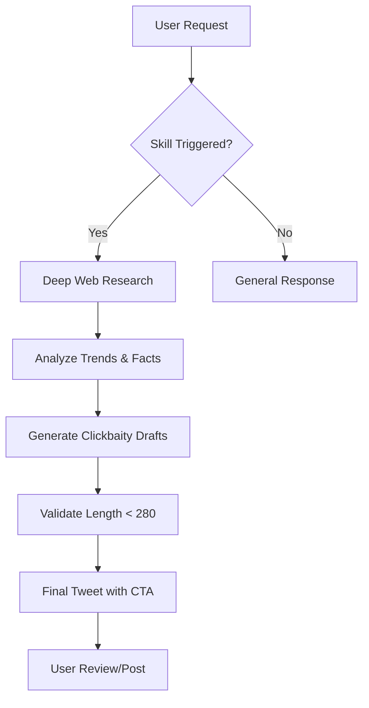

# AISkills 🚀

A collection of specialized AI skills for the Antigravity agent environment.

## 🛠 Available Skills

### 🐦 Writing Tweets
Helps in crafting research-backed, clickbaity tweets for X.com with high-engagement CTAs.
- **Path**: `.agent/skills/writing-tweets/`
- **Features**: Web research, length validation (280 chars), and CTA optimization.

### 💼 Writing LinkedIn Posts
Helps in crafting professional storytelling and research-backed posts for LinkedIn.
- **Path**: `.agent/skills/writing-linkedin-posts/`
- **Features**: Scroll-stopping hooks, industry research, and engagement-focused CTAs.

### 📄 Creating Resumes
Drafts professional, ATS-friendly resumes with a strictly structured hierarchy.
- **Path**: `.agent/skills/creating-resumes/`
- **Features**: Personal Details, Summary, Skills, Experience, Education, and Languages.

## 🔄 Skill Workflow Diagram

## 📂 Repository Structure

- `.agent/skills/`: Contains all skill logic and definitions.
    - `writing-tweets/`: Instruction sets for social media automation.

## 👤 Author
**Krishna Kumar**
[GitHub Profile](https://github.com/KrishnaKumar-commits)
