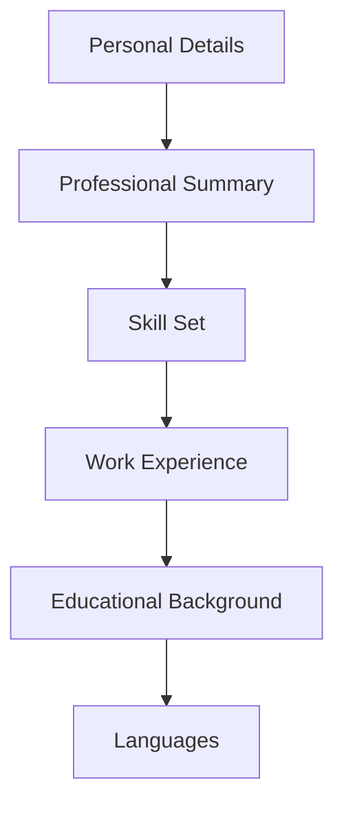

# Creating Resumes Skill 📄

This skill helps you build professional, ATS-optimized resumes with a structured hierarchy designed for clarity and impact.

## 🚀 Key Features

- **Structured Hierarchy**: Ensures your resume follows the proven order of Personal Details, Summary, Skills, Experience, Education, and Languages.
- **ATS Optimization**: Focuses on keyword placement and result-oriented achievement statements.
- **Professional Formatting**: Generates clean, ready-to-copy Markdown structures.

## 📊 Content Hierarchy

## 🛠 Usage

To trigger this skill, you can use prompts like:
- "Help me build a resume for a Senior Software Engineer role"
- "Create a new CV for me starting with my personal details"
- "Update my work experience section in my resume"

## 👤 Author
**Krishna Kumar**
[GitHub Profile](https://github.com/KrishnaKumar-commits)
