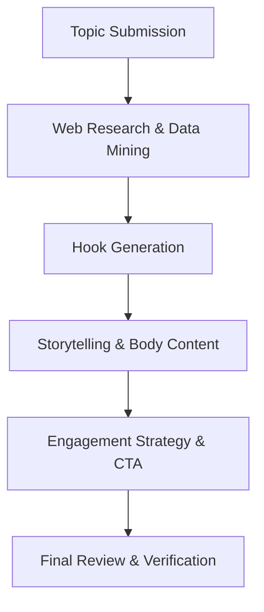

# Writing LinkedIn Posts Skill 💼

This skill helps you craft high-impact, research-backed LinkedIn posts that combine professional storytelling with strategic engagement.

## 🚀 Key Features

- **Deep Research**: Automatically finds industry trends, latest news, and key data points.
- **Scroll-Stopping Hooks**: Expertly crafted first lines to capture attention in the busy LinkedIn feed.
- **Viral Formatting**: Optimized use of whitespace and bullet points for high mobile readability.
- **Strategic CTAs**: Designed to drive comments and engagement based on the LinkedIn algorithm.

## 📊 How it Works

## 🛠 Usage

To trigger this skill, you can use prompts like:
- "Write a LinkedIn post about Agentic AI"
- "Help me draft a professional post for my new job"
- "Research the latest trends in Remote Work and write a LinkedIn post"

## 👤 Author
**Krishna Kumar**
[GitHub Profile](https://github.com/KrishnaKumar-commits)
