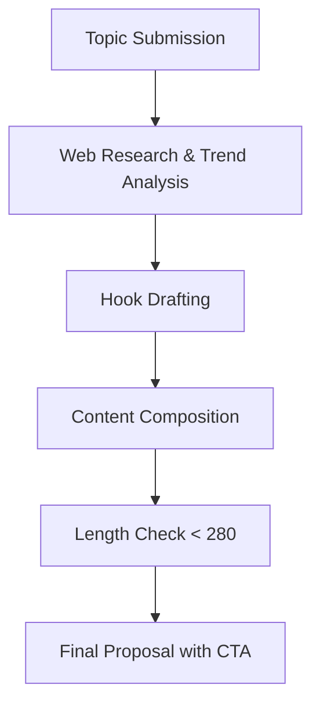

# Writing Tweets Skill 🐦

This skill helps you craft high-impact, research-backed tweets for X.com that are designed for maximum engagement and reach.

## 🚀 Key Features

- **Deep Research**: Searches for current trends, facts, and controversial angles.
- **Clickbait Hooks**: Punchy opening lines designed to stop the scroll.
- **Length Validation**: Strictly enforces the 280-character limit.
- **CTA Optimization**: Includes clear and compelling calls to action.

## 📊 How it Works

## 🛠 Usage

To trigger this skill, you can use prompts like:
- "Write a tweet about Budget 2026"
- "Create a clickbaity tweet about deep work"
- "Research the latest iPhone rumors and write a tweet"

## 👤 Author
**Krishna Kumar**
[GitHub Profile](https://github.com/KrishnaKumar-commits)
